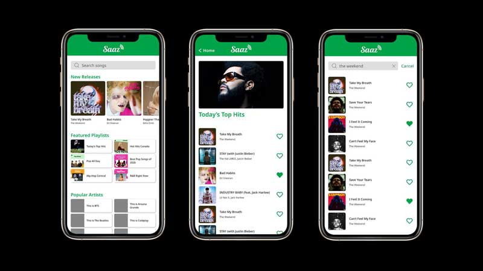

# Saaz
Saaz is a mobile app that allows you to browse Spotify's music tracks and playlists. When you tap on a song you have searched for in Saaz, the Spotify app will launch and you can listen to the music.

## Features
* Top horizontal sliding image banners have the list of New Releases. When you click on it, the particular track will be open up in Spotify App.
* Some recommended playlists are shown in the bottom half of the home page. If you click on one of them, you can see the contents of the playlist on a separate page. Clicking on a specific song will open it in the Spotify app.
* The search bar at the top of the homepage allows you to search for songs by artist name.
* You can add a heart icon to the songs you like.

## Technologies Used
* React Native
* Spotofy API

## Modules 
```
npm i --save styled-components
npm i react-native-snap-carousel
npm i react-native-dynamic-search-bar
npm i axios
```

## How to use
```
git clone https://github.com/sachinchaves/saaz
npm ci
npm start
```

## Design


## API Links for database
[Spotify API](https://developer.spotify.com/documentation/web-api/)

## Contributors
* [Sachin](https://github.com/sachinchaves)
* [Azusa](https://github.com/azusazusak)
